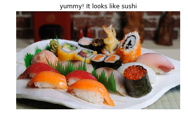

# Food image classification 

Food image classifier built with Convolutional Neural Networks (CNN). Given an image of food, the algorithm will identify an estimate of the food item. 

<p align="center">
	 
</p>

## Dataset 
We use [Food-101](https://www.vision.ee.ethz.ch/datasets_extra/food-101/) dataset published by Lukas Bossard, Matthieu Guillaumin, Luc Van Gool. 

The dataset contains 101 food categories with 101,000 images. For each class, 250 manually reviewed test images are provided as well as 750 training images. The training images were not cleaned on purpose, and thus still contain some amount of noise. 

The data is splitted into training and test data. We split the training set into a training and validation sets. We use thier test set to evaluate the model

## Final Model 
We use Inception v3 as a base model. It is pre-trained on ImageNet. `AveragePooling2D` and `Dropout` layers are added to reduce variance in the data and to avoid overfitting.

The model is trained for 16 epochs on Google Compute Engine with 1 GPU NVIDIA Tesla K80. It achieved 0.5419 training loss, 87.5% accuracy, and 96.875 % top-five accuracy. 

## Notebooks 
+ `0_dataset.ipynb` -- download the dataset and set-up data directories to train the model
+ `1_food_app.ipynb` -- train the model and predict given food image

## How to use?
### Prerequisites
The project uses `python3` from [anaconda](https://www.anaconda.com/) and packages such as `Keras` for deep learning (training and testing the model), `OpenCV` for loading iamges, and `matplotlib` for plotting graphs. 

### Getting Started 
1. Clone the repository and navigate to the downloaded folder.
```	
git clone https://github.com/TetsumichiUmada/food_app.git
cd food_app
```
2. Create an environemnt 
```
conda env create -f environment.yml
```

3. Open the notebooks.
```
jupyter notebook 
```

## References 

+ [Food-101 dataset](https://www.vision.ee.ethz.ch/datasets_extra/food-101/)
+ [Lu, Y. (2016). Food Image Recognition by Using Convolutional Neural Networks (CNNs). arXiv preprint arXiv:1612.00983](https://arxiv.org/abs/1612.00983).
+ [Attokaren, D. J., Fernandes, I. G., Sriram, A., Murthy, Y. S., & Koolagudi, S. G. (2017, November). Food classification from images using convolutional neural networks. In Region 10 Conference, TENCON 2017-2017 IEEE (pp. 2801-2806). IEEE.](https://ieeexplore.ieee.org/abstract/document/8228338/)
+ [Inception in TensorFlow](https://github.com/tensorflow/models/tree/master/research/inception)
+ [CS231n Convolutional Neural Networks for Visual Recognition
](https://cs231n.github.io/)
+ [Udacity Machine Learning Nanodegree Program](https://www.udacity.com/course/machine-learning-engineer-nanodegree--nd009t)


